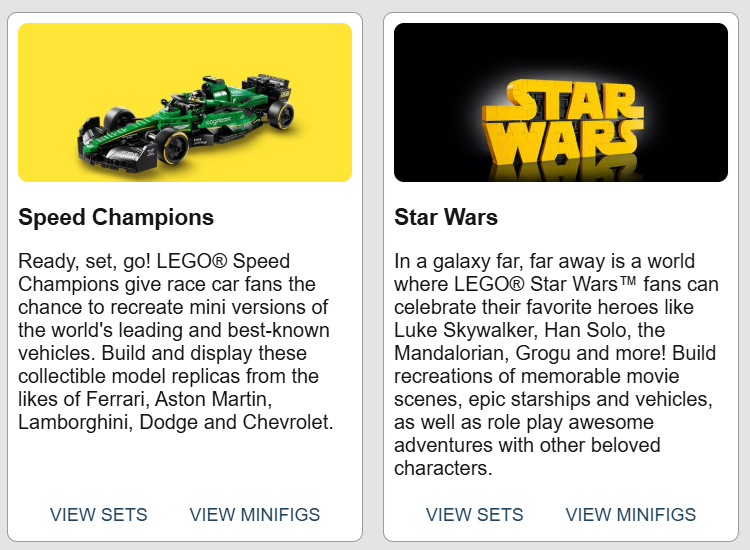

# Bricks

Search LEGO sets, minifigs, and parts.

## Getting Started

1. Clone the repo  
  `git clone https://github.com/nightwolfdev/bricks.git`
2. Navigate to the project folder  
  `cd bricks`
3. Install dependencies  
  `npm install`
4. Run the app  
  `ng serve`
5. Visit the app in a browser  
  `http://localhost:4200`

## Links

* [Demo](https://nightwolfdev.github.io/bricks/)
* [Angular](https://angular.io)
* [RxJS](https://rxjs.dev)
* [TypeScript](https://www.typescriptlang.org)
* [Rebrickable API](https://rebrickable.com/api/)